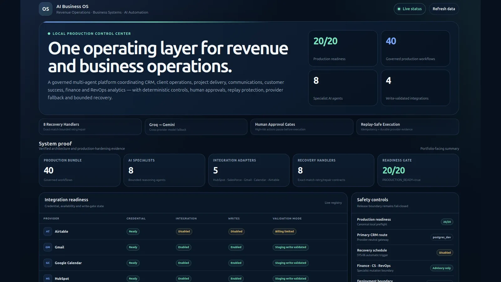
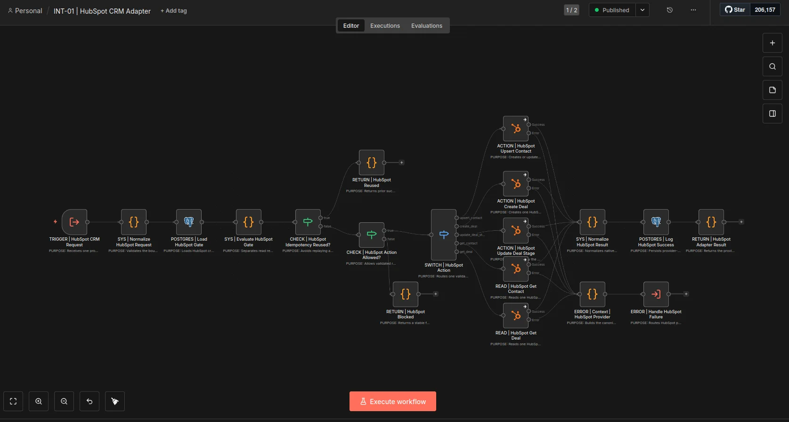
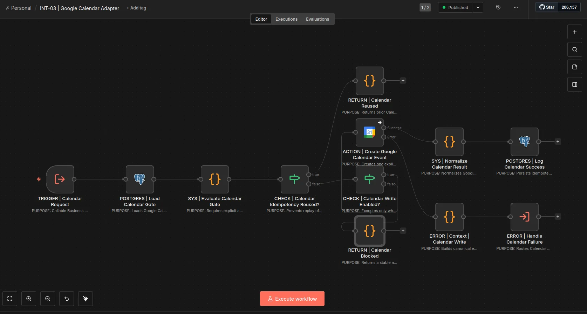
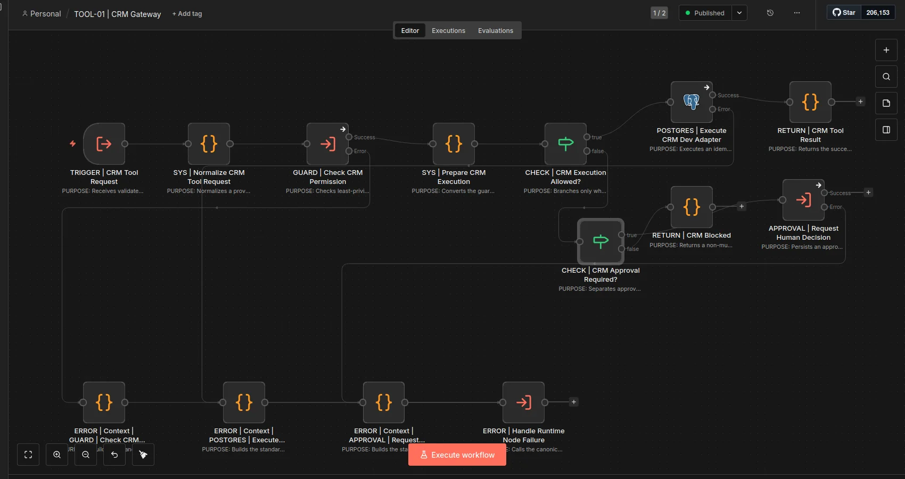
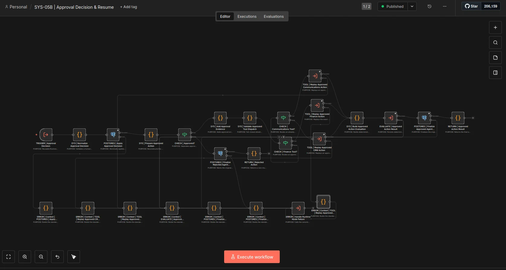
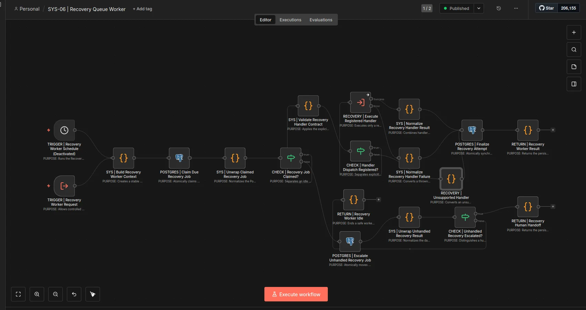
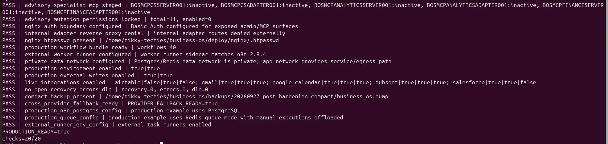
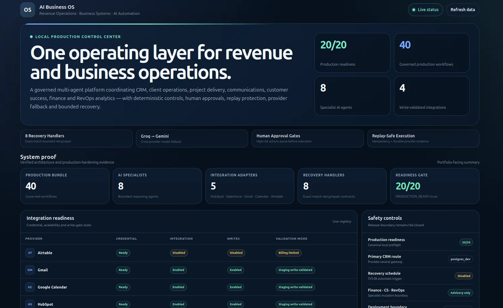

# AI Business OS — Production-Hardened RevOps & Business Systems Platform



A recruiter-facing technical case study for a **40-workflow AI-powered Revenue Operations and Business Systems platform** built with n8n and PostgreSQL.

The system coordinates **8 specialist AI agents** across CRM, client operations, project delivery, communications, customer success, finance and RevOps analytics, while keeping business-system changes behind deterministic controls, human approvals, idempotency and bounded recovery.

> **Deployment status:** verified **local production** only. The system passed a **20/20 production-readiness gate**. Public VPS, domain and TLS deployment are intentionally deferred.

## Why I Built It

Operational teams often accumulate separate automations for CRM, email, calendar, onboarding, project delivery and reporting. As the number of workflows grows, so do the risks: duplicated actions, unclear ownership, brittle retries, inconsistent handoffs and limited visibility.

I designed the AI Business OS as a governed operating layer rather than a collection of point-to-point automations.

## What I Own in the System

- End-to-end architecture for event routing, specialist-agent responsibilities and execution boundaries
- Provider-neutral CRM execution and integration contracts
- Permission, risk, approval and business-rule controls
- Human-in-the-loop approval and exact-action resume
- Idempotency and replay-safe provider writes
- Centralized error handling, DLQ and bounded recovery
- Groq primary reasoning with Gemini cross-provider fallback
- Local production-readiness validation, rollback backups and operational monitoring

## Verified System Proof

| Area | Verified proof |
| --- | --- |
| Production workflows | **40** |
| Specialist reasoning agents | **8** |
| Recovery handlers | **8 exact-match handlers** |
| Integration adapters | **5** |
| Controlled staging-write validated providers | **4 — HubSpot, Salesforce, Gmail, Google Calendar** |
| Production-readiness gate | **20/20** |
| Cutover incident state | **0 recovery jobs, 0 unresolved errors, 0 unresolved DLQ** |

## Architecture

```text
Business Event
   ↓
Normalize + Correlation + Idempotency Context
   ↓
AGENT-00 Supervisor
   ↓
Bounded Domain Specialist
   ↓
Provider-Neutral Tool Gateway
   ↓
Deterministic Guardrails
   ├─ Permissions
   ├─ Required Inputs
   ├─ Risk Rules
   ├─ Human Approval
   └─ Business Rules
   ↓
Idempotent Business / Provider Action
   ↓
Deterministic Evaluation
   ↓
Audit Evidence + Operational Status
   ↓
Exact-Match Recovery or Human Escalation
```

## Specialist Agent Model

The platform uses one Supervisor and seven domain specialists:

1. Sales CRM
2. Client Operations
3. Project Operations
4. Communications
5. Finance & Billing
6. Customer Success
7. RevOps Analytics

All eight reasoning workflows use **Groq as the primary provider** and **Google Gemini as an independently configured fallback**.

Finance & Billing, Customer Success and RevOps Analytics remain **advisory-only** until separate mutation contracts are designed and validated.

## Governance & Safety

### Least-Privilege AI Execution
Agents reason and recommend actions but do not receive unrestricted database or provider mutation authority.

### Human Approval
High-risk actions pause in a durable approval workflow. The approved action is stored and resumed exactly rather than regenerated by the model.

### Replay-Safe Execution
Stable idempotency keys and durable provider evidence prevent successful CRM, email or calendar actions from being repeated during retries.

### Fail-Closed Recovery
Recovery runs only when an exact registered handler and durable retry contract exist. Missing or ambiguous evidence escalates to human review.

## Integration Layer

### HubSpot CRM
The adapter supports guarded contact and deal operations with integration gating, idempotency reuse, success logging and centralized provider error handling.



### Google Calendar
The Calendar adapter checks prior idempotency evidence before creating an event, reuses a prior successful result on replay and enforces a separate write gate.



### CRM Gateway
CRM execution remains provider-neutral. The current local primary route is PostgreSQL, while HubSpot and Salesforce sit behind governed adapters and independent write controls.



## Human Approval & Recovery

### Approval Decision & Exact Action Resume
The approval-resume workflow applies a human decision, reconstructs the stored action, validates dispatch, routes the approved business action, evaluates the result and finalizes durable state.



### Bounded Recovery
The Recovery Queue Worker claims due work, validates the registered recovery contract, executes only approved handlers and escalates unsupported or unresolved work.



## Production-Readiness Evidence

The canonical local validator confirms:

```text
PRODUCTION_READY=true
checks=20/20
```



The validator checks workflow packaging, cross-provider fallback, integration gates, production flags, recovery state, backup availability, PostgreSQL/Redis production configuration, task-runner configuration, auth boundaries and disk headroom.

## Control Center

I built a read-only local control surface that exposes live system proof without displaying credentials, tokens or customer message content.

It shows:
- production readiness
- workflow and agent counts
- integration readiness
- safety controls
- recovery, approval, error and DLQ state
- agent activity
- local demonstration records



## Technology Stack

**Automation & orchestration:** n8n  
**Database:** PostgreSQL  
**CRM:** HubSpot, Salesforce, provider-neutral PostgreSQL gateway  
**Communication & scheduling:** Gmail, Google Calendar  
**AI providers:** Groq, Google Gemini  
**Infrastructure:** Docker, Redis-oriented production queue configuration, Nginx production boundary  
**Validation:** Python production-readiness and fallback validators

## What This Project Demonstrates

This project is evidence of how I approach **Revenue Operations, CRM/Business Systems and AI-enabled operations**:

- translate business processes into governed systems
- separate AI reasoning from deterministic execution
- design CRM and integration controls around business risk
- protect provider writes from duplicate replay
- build for approvals, failure recovery and auditability
- validate a system before calling it production-ready

## Links

- **Live case study:** https://nikkytechies-portfolio.vercel.app/projects/ai-business-os-multi-agent-operations
- **Portfolio:** https://nikkytechies-portfolio.vercel.app/
- **LinkedIn:** https://www.linkedin.com/in/ganiyu-basirat-308ab9403
- **GitHub profile:** https://github.com/Nikkypwetti

---

**Note:** This repository documentation intentionally excludes secrets, credentials, private workflow exports and customer data.
