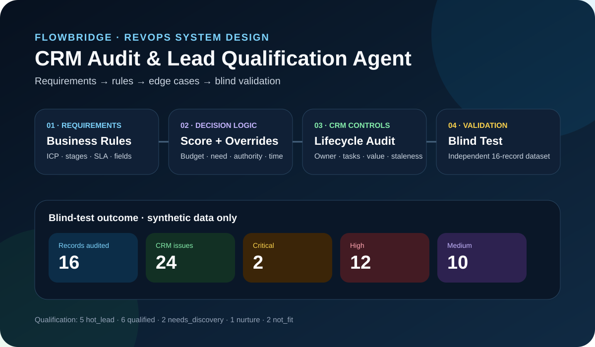
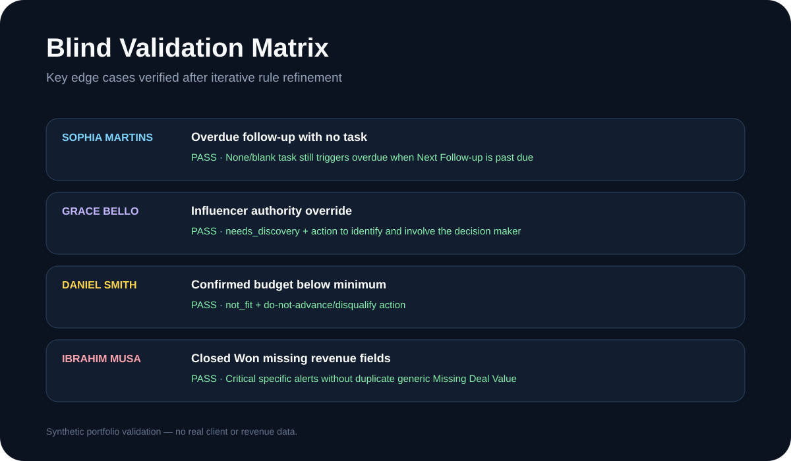

# FlowBridge RevOps CRM Audit & Lead Qualification Agent

## Project Summary

FlowBridge is a fictional B2B automation consultancy used to practice a real RevOps / Business Systems requirements-to-implementation workflow.

The project focuses on converting business requirements into deterministic lead qualification logic, CRM validation rules, lifecycle-aware controls, severity levels and action recommendations that can be packaged as a reusable Manus Agent Skill.

> **Data note:** All records, company details and results in this case study are synthetic portfolio data. They do not represent client revenue or production business outcomes.

## Business Requirements

FlowBridge needed consistent qualification and CRM controls across leads and opportunities.

Core qualification inputs:

- Budget
- Need
- Authority
- Timeline

CRM controls included:

- Active lead ownership
- Proposal follow-up tasks
- Opportunity Deal Amount
- Closed Won amount and close date
- Closed Lost reason
- Overdue follow-up
- 14+ day stale opportunities
- Lifecycle-consistent activity types

## Qualification Model

The deterministic score totals 100 points:

| Factor | Weight |
| --- | ---: |
| Budget | 30 |
| Need | 20 |
| Authority | 30 |
| Timeline | 20 |

Final qualification states:

- `hot_lead`
- `qualified`
- `needs_discovery`
- `nurture`
- `not_fit`

The score does not decide the final status by itself. Explicit business-rule overrides take precedence.

## Override Precedence

1. Confirmed budget below $1,000 → `not_fit`
2. Missing critical qualification information → maximum `needs_discovery`
3. Authority = Influencer → maximum `needs_discovery`
4. Timeline > 90 days → maximum `nurture`
5. Otherwise apply the normal qualification rules

## Validation Design

Manual edge-case exercises were used before packaging the Skill to confirm that the business rules were internally consistent.

The final validation used a separate blind spreadsheet with:

- no expected-status column;
- no answer-key sheet;
- 16 synthetic CRM records;
- September 20, 2026 as the fixed audit date.

## Blind-Test Results

- **16** synthetic CRM records audited
- **24** rule-defined CRM issues
- **2 Critical**
- **12 High**
- **10 Medium**

Qualification distribution:

- **5** `hot_lead`
- **6** `qualified`
- **2** `needs_discovery`
- **1** `nurture`
- **2** `not_fit`

## Key Edge Cases Verified

### Sophia Martins
Validated that an overdue follow-up is still flagged when the Next Follow-up date is past due and the task status is `None`, rather than incorrectly requiring an open task.

### Grace Bello
Validated the Influencer authority override. The final status remained `needs_discovery`, with an action to identify and involve the decision maker.

### Daniel Smith
Validated the below-minimum budget override. The final status remained `not_fit`, with a do-not-advance / disqualify action unless budget or scope changes.

### Ibrahim Musa
Validated Closed Won-specific rules. Missing Deal Amount and Close Date were flagged as Critical while the generic Missing Deal Value alert was suppressed to avoid duplicate findings.

## Design Safeguards

- Never invent missing CRM values.
- Keep lead Budget separate from actual opportunity Deal Amount.
- Apply stage-specific validation only where the lifecycle requires it.
- Do not treat valid Customer Onboarding activity after Closed Won as an error.
- Recommended actions must account for the final qualification status plus all Critical and High issues.
- Preserve an explicit distinction between qualification quality and CRM/process health.

## Remaining Refinement

A minor future refinement is to make closed-opportunity action wording fully lifecycle-specific so a Closed Won record never receives generic language such as “progress opportunity execution.”

## Portfolio Skills Demonstrated

- Revenue Operations requirements discovery
- CRM data governance
- Lead qualification design
- Business-rule and override design
- Data dictionary design
- Conditional validation
- Pipeline-health logic
- Lifecycle-aware CRM controls
- UAT / edge-case testing
- AI Agent Skill design
- Blind validation and iterative refinement
